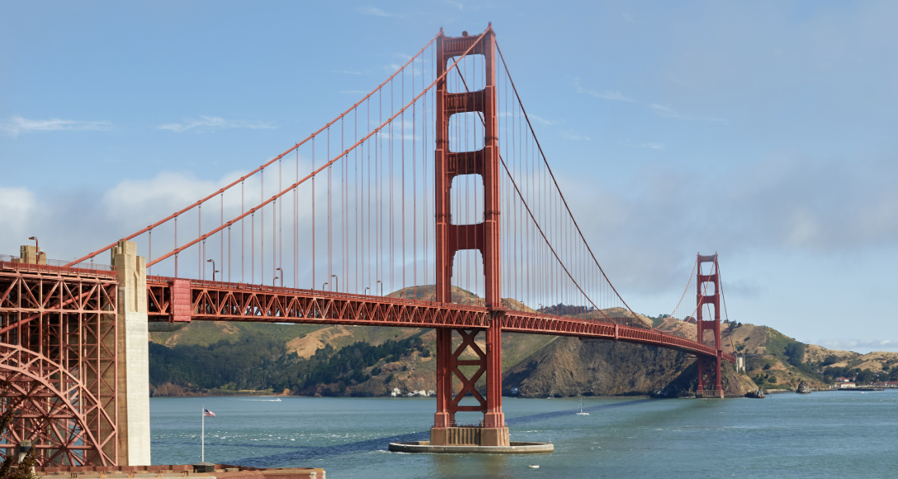
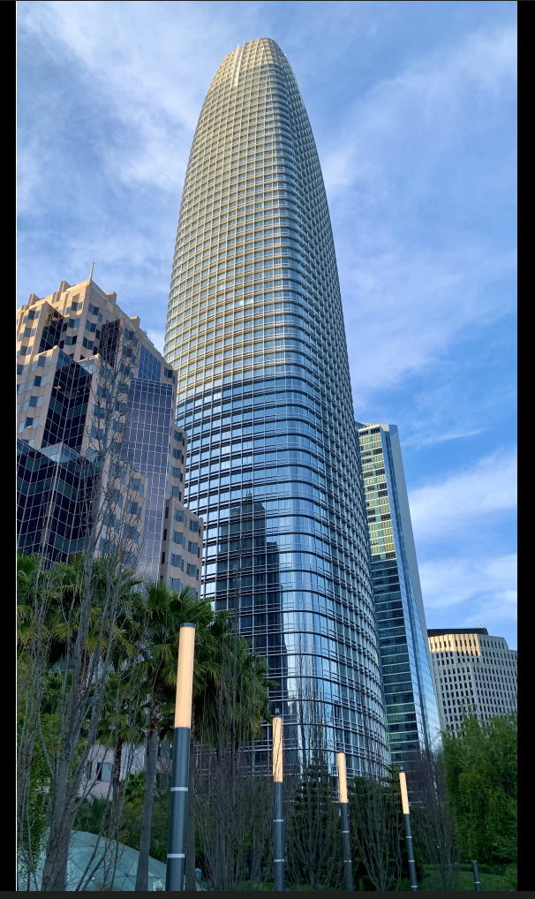

# VisionMap 🗺️

A Visual Positioning System (VPS) pipeline. Upload geolocated images to build a reference database, then query with a new photo to determine where it was taken — the same approach that powers AR localization in Pokémon GO.

**Tech:** Python · FastAPI · PyTorch (ResNet18) · PostgreSQL + pgvector · Docker

## Architecture

```
           ┌──────────────┐
           │  POST /ingest│
           │  POST /localize
           └──────┬───────┘
                  │
           ┌──────▼───────┐
           │   FastAPI     │     asyncio.to_thread()
           │   (async)     │─────────────────────────┐
           └──────┬───────┘                          │
                  │                          ┌───────▼────────┐
                  │                          │  ResNet18       │
                  │                          │  Feature        │
                  │                          │  Extractor      │
                  │                          │  (512-d output) │
           ┌──────▼───────┐                  └───────┬────────┘
           │  PostgreSQL   │◄────────────────────────┘
           │  + pgvector   │
           │  (HNSW index) │
           └──────────────┘
```

## Quick Start

```bash
docker compose up --build -d
```

API at `http://localhost:8000` · Docs at `http://localhost:8000/docs`

## Demo

### Ingest — Store a geolocated image

**`POST /ingest`** (form-data)

| Field | Value |
|---|---|
| `file` | `golden-gate.png` |
| `image_name` | `golden_gate` |
| `latitude` | `37.8199` |
| `longitude` | `-122.4783` |

```json
{
  "status": "ok",
  "id": "828d1c60-f886-4ad4-8922-bfa7914146ce",
  "image_name": "golden_gate",
  "embedding_dims": 512,
  "timing": {
    "inference_ms": 101.0,
    "db_insert_ms": 5.8,
    "total_ms": 106.8
  }
}
```

### Localize — Find where a photo was taken

**`POST /localize`** (form-data)

| Field | Value |
|---|---|
| `file` | query image |
| `top_k` | `5` |

```json
{
  "status": "ok",
  "matches": [
    {
      "image_name": "golden_gate",
      "latitude": 37.8199,
      "longitude": -122.4783,
      "similarity": 1.0
    },
    {
      "image_name": "sf_tower",
      "latitude": 37.7946,
      "longitude": -122.3999,
      "similarity": 0.656
    }
  ],
  "timing": {
    "inference_ms": 145.0,
    "db_search_ms": 14.1,
    "total_ms": 166.3
  }
}
```

### Screenshots

| Ingest | Localize | Database |
|---|---|---|
|  |  |  |

### Reference Images Used

| Golden Gate | SF Tower |
|---|---|
|  |  |
